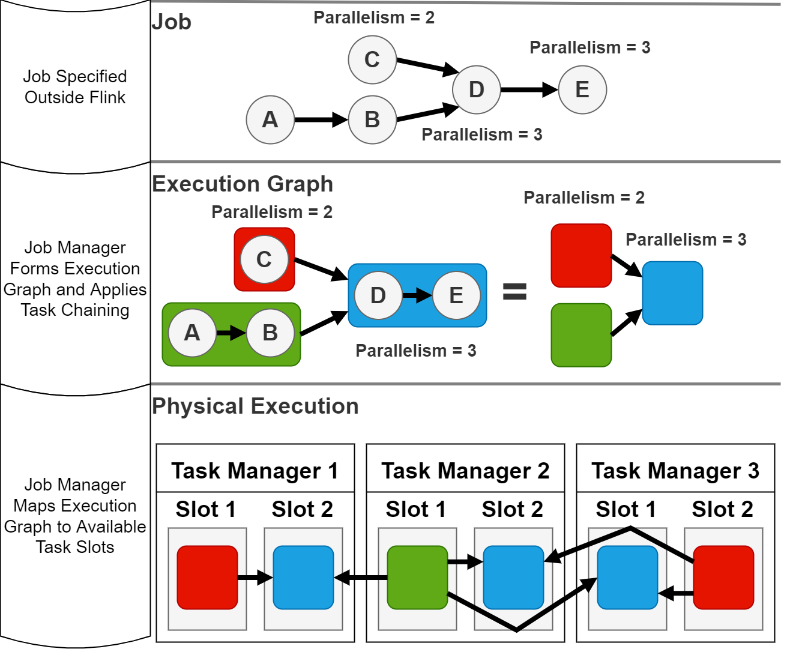
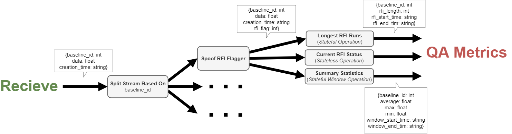
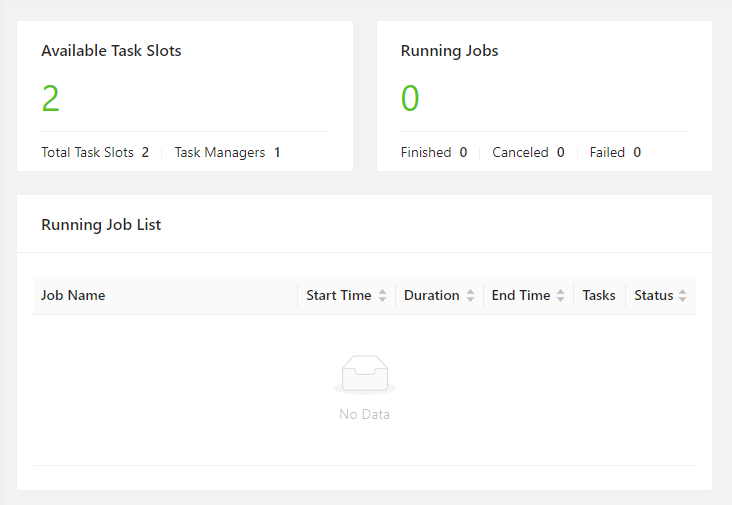
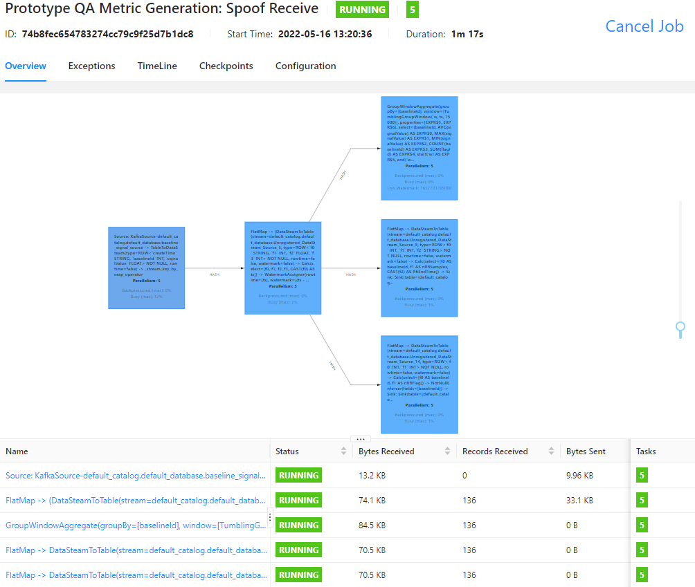
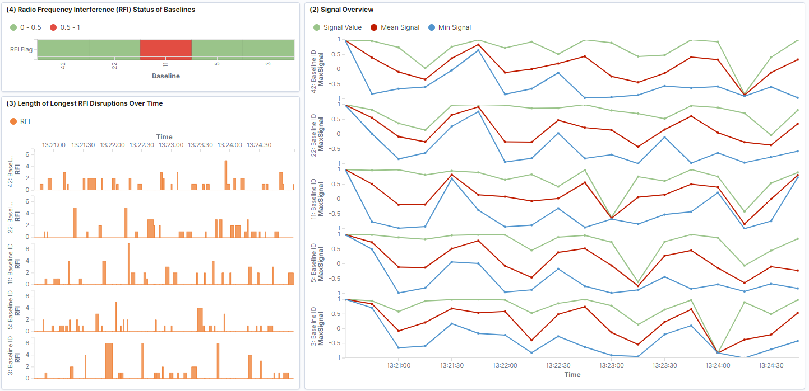
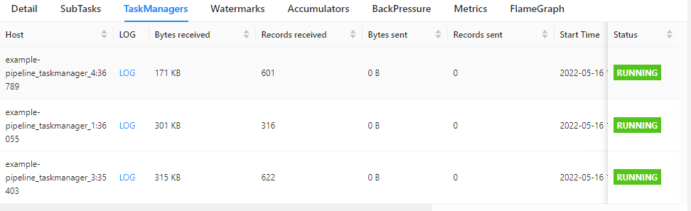
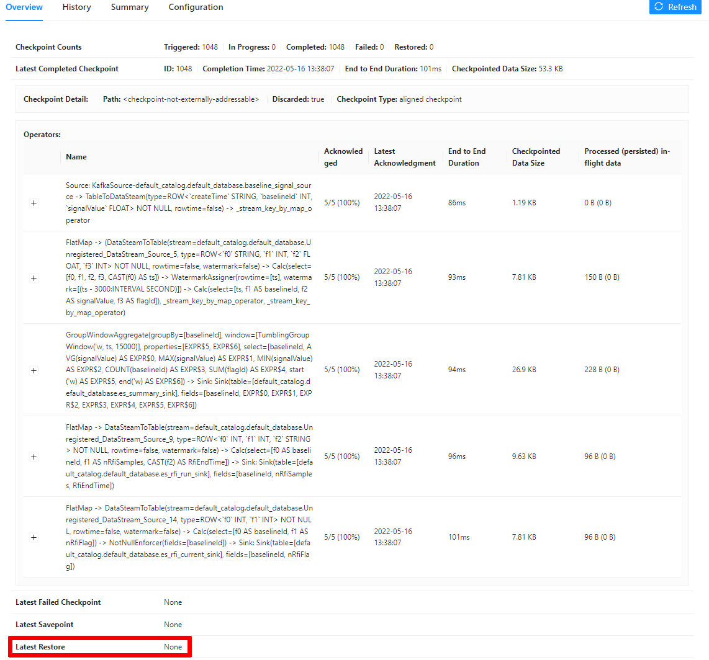

## Signal Quality Assessment Pipeline
For the Square Kilometre Array (SKA) radio telescope, it is important to be able to quickly judge the quality of signals received from the baselines. This is so malfunctions or anomalous behaviour can quickly be identified. Signal quality assessment (QA) is therefore chosen as an example to illustrate a use case for distributed streaming processing for the SKA.

A quality assessment pipeline should convey the signal integrity, as well as the presence of radio-frequency interference (RFI) to a telescope operator. This is accomplished by calculating *QA metrics* based on signal properties and detected RFI, these metrics can then be visualised to quickly inform an operator of the status of the telescope.

### Reasons for Streaming instead of Batch Processing for QA
The telescope receives signals as a continuous stream of measurements. Since batch processing inevitably requires a batch to be collected, the results for one batch can not be obtained until the last element has arrived, this introduces an inherent latency. An increased latency of quality assessment data may have adverse effects, as it means longer before problems can be identified and remedied, reducing the effectiveness of a radio telescope. Stream processing processes records as they arrive which reduces the latency between a record being generated and it affecting a QA metric.

Furthermore, in batch processing the state is usually only preserved per batch of data, so remedying the latency problem outlined above by using smaller batch sizes can cause issues. Say for example that batches of 10 seconds are used, if an antenna is constantly experiencing RFI batch processing would only be able to record that it is experiencing continous RFI for 10 seconds, whereas stream processing has no such limitation. 

Related to the point above, the batch size also introduces an upper limit for how much data can be included in aggregate statistics. So if 1 second batches are used, to reduce the latency, then calculating statistics from 15 second time windows is not easily possible, as this relies on the state of 15 batches.

All of these limitations of batch processing for quality assessment connect back to a fundamental insight behind streaming processing: "if data is generated as a stream, introducing batches is artificial". 

## Implementing an Example QA Pipeline with Apache Flink

Apache Flink is a framework for stateful streaming processing with exactly once state consistency. It achieves high performance by leveraging in memory speeds when working with state. Flink is used by large organisations including: Amazon, Alibaba, Tencent and Ericsson.
### Apache Flink for streaming
A Flink deployment consists of two main parts, running in separated containers, a **job manager**, and one or several **task managers**. Task managers are the worker processes in Flink. Each task manager has one or several **task slots**. The job manager allocates work to the task slots of different task managers.

Flink works by that you submit a **Flink job**, this is a high level description of how you want to process a datastream stream. Using python and pyflink you can create a job file. The job specifies what operations should take place on the stream and in what order, as well as the sources and sinks of the stream outside Flink. 

To execute a job you submit it to the **job manager**. When receiving a job the job manager translates the instructions into an execution graph, this can involve "chaining" logically connected parts of a job together, called task chaining. Task chaining is done for performance as "fused tasks exchange records by method calls and thus with basically no communication costs" [[1](https://learning.oreilly.com/library/view/stream-processing-with/9781491974285/ch10.html#chap-10-chaining)]. Having formed an execution graph the job manager looks at the task managers (workers) and task slots available and maps the execution graph to the task slots in such a way to optimise for performance, for example by putting tasks which communicate heavily on task slots on the same worker, to reduce communication costs. Tasks in slots on the same task manager can exchange data effectively, but tasks in slots on different task managers communicate over slower network protocols. 

For a job consisting of processes **A**,**B**,**C**,**D**,**E** with specified parallelisms, the process of: (1) specifying a job, (2) execution graph creation and task chaining, (3) then mapping to cluster resources is shown in ***Fig. 1***, this image is a toy picture to illustrate the concepts, not meant to depict ground truth. Chapter 3 of [this book](https://learning.oreilly.com/library/view/stream-processing-with/9781491974285/ch03.html#chap-3-app-deployment) contains good illustrations and useful information on this.

       
***Fig. 1** How a Flink job is transformed into an execution graph and then mapped to available task slots.*


Task chaining as well as how other job manager optimisations are applied, can be controlled to further improve performance. Such optimisations include slot sharing groups, controlling what tasks should be executed in the same slot.
In the job there can be an overall parallelism specified, this is tells the job manager what parallelism all, or parts, of the job should execute with.  In the job you can also specify a checkpointing strategy: how often to back up the state if an error occurs, and a restart strategy: how to attempt restarts if a job fails.
### QA pipeline as a Flink job

⚠️**Since Flink needs to read data from somewhere and write data somewhere Kafka and Elasticsearch are included to provide a complete example pipeline. These technologies are not critical to the functioning of the pipeline but merely included for illustrative purposes. The distributed streaming processing is all handled by Flink.** ⚠️

This is a prototype to show how a distributed streaming pipeline for quality assessment of radio astronomy signals may be implemented using Flink. This consists processing simplified signals from baselines (elements of a radio telescope), and flagging the signal if it contains radio-frequency interference (RFI). Some metrics which may be used to gauge the signal quality and functioning of the fictional radio telescope are calculated from the data. For purely illustrative purposes which does not affect the actual streaming processing the calculated QA metrics are written to elasticsearch and can be seen on a Kibana dashboard.


### Overview of Pipeline
The pipeline (shown pictorially in ***Fig. 2***) implemented as a Flink job consist of the following steps:

1. A stream of mock receive data, consisting of mock visibilities (floats) from spoof baselines is received. 
2. The input stream is split depending on the baseline, this is to allow the QA metric calculation and spoof RFI flagging for different baselines to be distributed and parallelised.
3. A spoof RFI flagger generates flags for each visibility.
4. This flagged stream is again split so three different QA Metrics can be calculated independently.
5. The calculated QA metrics are outputted.


         
***Fig. 2** Overview of the quality assessment pipeline in this example.*

## Running the Job
**If you are running this example remotely using ssh you may need to forward ports to see the web UI's from your local browser**. For a remote machine named: `<remote machine>` this may be done using:
```
 ssh -L 1234:localhost:8081 -L 1235:localhost:5601 -L 1236:localhost:9200 <remote machine>
```
Then modify the port numbers appropriately when accessing the web UI's. So Flink web UI would then be on port 1234, Kibana on 1235 and Elasticsearch on 1236.
### With Docker Installed
### Installing Docker
**Since the example is containerised and relies on docker-compose you need to have the docker engine and docker compose installed.**
The instructions [here](https://docs.docker.com/engine/install/) show how to install docker. On Linux you can use the following commands to install what you need:
```
sudo apt-get update
sudo apt-get install docker-ce docker-ce-cli containerd.io docker-compose-plugin
```
Run the following command to verify that docker is installed.
```
sudo docker run hello-world
```
To start the example, build the images:
````commandline
sudo docker-compose build
````

Then start the containers
````
sudo docker-compose up -d
````

To see the spoof "received data" being sent you can run:
````
sudo docker-compose exec kafka kafka-console-consumer.sh --bootstrap-server kafka:9092 --topic baseline_signal
````
To see the elasticsearch data for the different QA metrics (before the job there should be none) look at:         
[http://localhost:9200/example_pipeline_summary_1/_search?pretty&size=50](http://localhost:9200/example_pipeline_summary_1/_search?pretty&size=50),           
[http://localhost:9200/example_pipeline_rfi_run_1/_search?pretty&size=50](http://localhost:9200/example_pipeline_rfi_run_1/_search?pretty&size=50),        
[http://localhost:9200/example_pipeline_rfi_current_1/_search?pretty&size=50](http://localhost:9200/example_pipeline_rfi_current_1/_search?pretty&size=50)

Since the Flink container is now running you should see that you have one task manager ([covered here](../FlinkandPyflink.md)) with two task slots and no jobs running. If you open Flink Web UI [http://localhost:8081](http://localhost:8081) it should look as in ***Fig. 3***

         
***Fig. 3** Flink Web UI on startup.*

**The job has a specified parallelism of 5 and therefore requires at least 5 task slots.**
Launch more task managers (each with two slots in this case) to get 5 task slots or more. To launch more task managers, so the total is ```<N>``` use.

```
sudo docker-compose scale taskmanager=<N>
```
The Flink Web Ui should show the new number of task managers and task slots.

Submit the job using
````commandline
sudo docker-compose exec jobmanager ./bin/flink run -py /opt/example-pipeline/example_qa_job.py -d
````

The job should now be shown as running in the UI and if you click the job name you will get information regarding the job, as in ***Fig. 4***.

         
***Fig. 4** Flink Web UI showing the job.*

The Elasticsearch [http://localhost:9200](http://localhost:9200) database should now contain records, which you can inspect using the URL's above.

**You can now look at the Kibana Dashboard showing the QA metrics generated**. Going to Kibana [http://localhost:5601](http://localhost:5601), and navigating to **Dashboards in the sidebar** and then selecting the *"Signal Quality Assessment Prototype Dashboard"* should bring up a page showing the live metrics (click refresh to update them), the dashboard should appear as in ***Fig. 5***.

       
***Fig. 5** Kibana Dashboard showing metrics calculated by the Flink job.*

To shut down the example use.
```
sudo docker-compose down
```
## When the Job is Running

### Testing checkpointing
To check that the checkpointing and state recovery system works correctly you can kill a taskmanager which is being used and see how Flink deals with this.
To find a task manager in use, click one of the processes in the UI, either by clicking the blue box, or by selecting its name. Then navigate to the **Task Managers** tab, you should see what task managers execute this process, as in ***Fig. 6***.

          
***Fig. 6** List of task managers in use by this process.*
In ***Fig. 6*** the task manager ``example-pipeline_taskmanager_4`` is in use, we will see what happens if this stops. 

However first look at the **Checkpoints** tab of the job, this shows all the checkpoints of the state that the job manager keeps (checkpoint strategy is specified in the job). The **Checkpoints** tab should appear as in ***Fig. 7***

         
***Fig. 7** The latest restored checkpoint is highlighted, in this case no error has occurred so the state has not been restored from a checkpoint.*

If you kill ``example-pipeline_taskmanager_4`` using:
```
sudo docker kill example-pipeline_taskmanager_4
```

The job will then predictably fail. When the job manager notices the worker has died (so number of workers decreases in the Web UI), it will utilise other task slots and restore the state from a checkpoint, so the "Latest Restore" will update to reflect this, and no data should be lost (can be confirmed by checking the records in Elasticsearch). 

This ability to have ***exactly once*** consistency with quick stateful streaming processing, specifying only the job and the job manager taking care of the rest is one of the main appeals of FLik (to the best of my understanding).

## Stopping the example
To shut down the example.
```
sudo docker-compose down
```

# Multi-node deployment
Multi-node Flink deployments are possible. The process for how to do this is described in [Multi-node_Intsructions.md](Multi-node_Intsructions.md). This document walks through the process of running this pipeline on distributed across multiple nodes step by step.