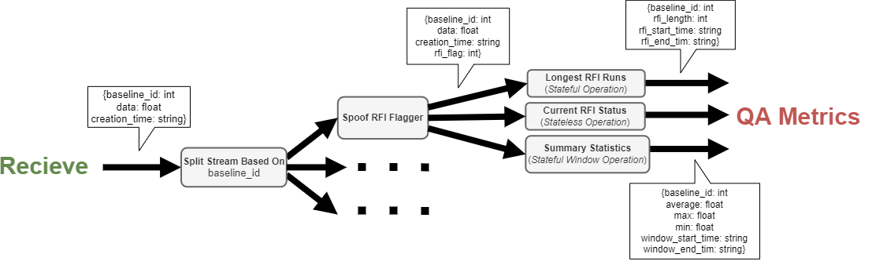

## Signal Quality Assessment (QA) Pipeline Example

This example is meant as a prototype to show how a distributed streaming pipeline for quality assessment of radio astronomy signals may be implemented using Flink. This consists of generating simplified signals from baselines (elements of a radio telescope). and then flagging the signal if it contains radio-frequency interference (RFI). Some metrics which may be used to gauge the signal quality and functioning of the fictional radio telescope are calculated from the data. These metrics are written to elasticsearch and can be seen on a Kibana dashboard.


### Overview of Pipeline
The pipeline (shown pictorially in ***Fig.1***) consist of the following steps:

1. A stream of mock receive data, consisting of mock visibilities (floats) from spoof baselines is received via Kafka. 
2. The input stream is split depending on the baseline, this is to allow the QA metric calculation and spoof RFI flagging to be distributed and parallelised for different baselines.
3. A spoof RFI flagger generates flags for each visibility.
4. This flagged stream is again split so three different QA Metrics can be calculated independently.
5. The calculated QA metrics are saved in an Elasticsearch database.



***Fig. 1** Overview of the quality assessment pipeline in this example.*

## Running the Job

To start the example, build the images:
````commandline
sudo docker-compose build
````

Then start the containers
````
sudo docker-compose up -d
````

To see the payment messages being sent you can run:
````
sudo docker-compose exec kafka kafka-console-consumer.sh --bootstrap-server kafka:9092 --topic baseline_signal
````
To see the elasticsearch data (before the job there should be none) look at [http://localhost:9200/example_pipeline_summary_1/_search?pretty&size=50](http://localhost:9200/example_pipeline_summary_1/_search?pretty&size=50), [http://localhost:9200/example_pipeline_rfi_run_1/_search?pretty&size=50](http://localhost:9200/example_pipeline_rfi_run_1/_search?pretty&size=50), and [http://localhost:9200/example_pipeline_rfi_current_1/_search?pretty&size=50](http://localhost:9200/example_pipeline_rfi_current_1/_search?pretty&size=50)

Submit the job
````commandline
sudo docker-compose exec jobmanager ./bin/flink run -py /opt/example-pipeline/example_qa_job.py -d
````

** This should not do anything as there are not enough task slots for the parallelism**
Launch more task managers to get 5 task slots at least
To launch more task managers, so the total is ```<N>```.

```
sudo docker-compose scale taskmanager=<N>
```

The job should not run correctly.

You can inspect the job at the various stages at:  
Flink Web UI [http://localhost:8081](http://localhost:8081).   
Elasticsearch [http://localhost:9200](http://localhost:9200).   
Kibana [http://localhost:5601](http://localhost:5601).


On Kibana there is a dashboard showing the different QA metrics.

To shut it down.
```
sudo docker-compose down
```
## When the Job is Running
[WIP]

Visualising results.

Killing a task manager, seeing it being restored using a checkpoint.

###Considerations
If the job suddenly fails as the parallelism increases, a cause may be that some watermarks are not used. Thus parts of the execution halts indefinitely waiting for the unused watermark, this does not throw an error and can be difficult to troubleshoot.
